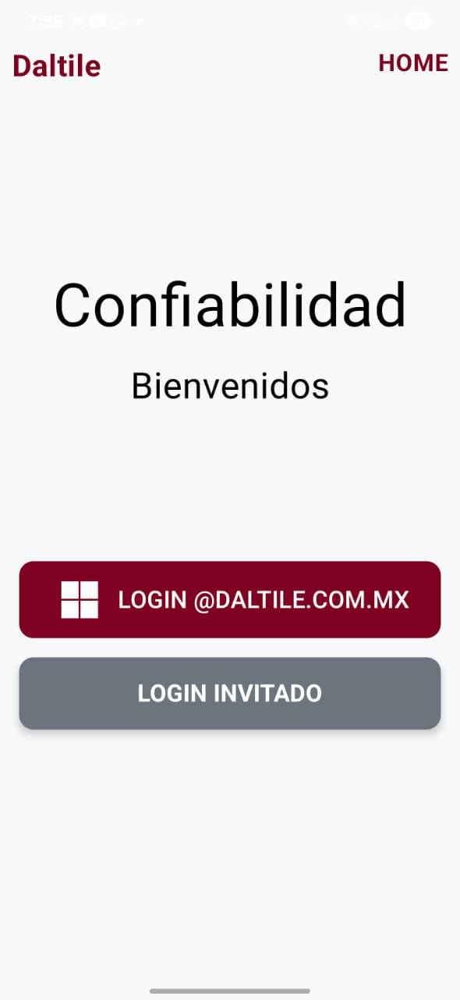
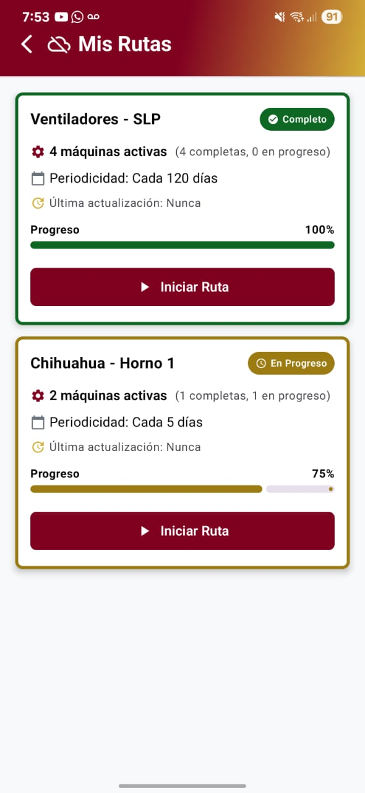
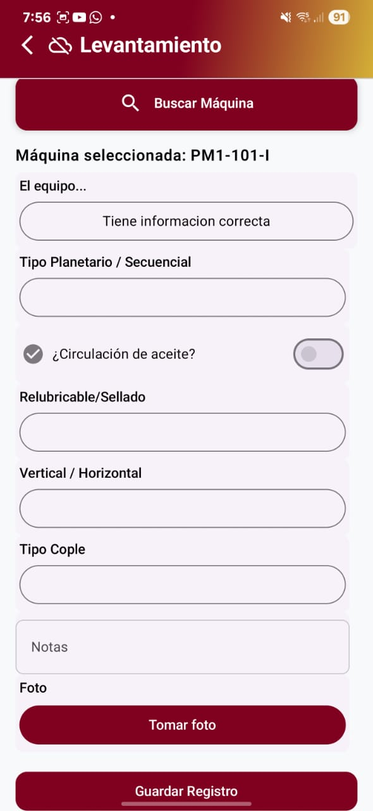

# 🗂 Portafolio de Proyectos Privados

Hola, soy **Bryan Flores**, Ingeniero de Software. La mayoría de mis proyectos están bajo acuerdos de confidencialidad o son propiedad de terceros, por lo que no puedo compartir directamente el código fuente.

Este repositorio resume de forma general algunos de mis proyectos más relevantes.

---

## 📦 Índice

- [⚙️ API de Confiabilidad](#️-api-de-confiabilidad)
- [🌐 Portal Web de Confiabilidad](#-portal-web-de-confiabilidad)
- [📱 App Móvil de Confiabilidad](#-app-móvil-de-confiabilidad)
- [📋 Otros proyectos menores](#-otros-proyectos-menores)
- [📩 Contacto](#-contacto)

---

## ⚙️ API de Confiabilidad

> Backend robusto para la gestión y análisis de datos técnicos en el sector industrial.

### 🏢 Propósito y Contexto

Desarrollada para **Grupo Daltile**, esta API actúa como **núcleo central de datos** para aplicaciones móviles y web encargadas de levantar información de equipos industriales.  
Permite registrar y consultar información crítica sobre la operación y confiabilidad de maquinaria.

### 🧩 Tecnologías Utilizadas

- **Lenguaje:** PHP 8 (arquitectura modular basada en servicios)
- **Base de datos:** MySQL
- **Seguridad y autenticación:**
  - JWT con control granular de permisos
  - OAuth 2.0 vía Microsoft Azure AD
- **Dependencias:** Composer

### 📌 Funcionalidades Clave

- 🔐 Autenticación dual (Azure + email/contraseña)
- 📝 Registro técnico (inspecciones, evidencias como fotos por ejemplo)
- 📊 Consulta estructurada
- ⚙️ Gestión jerárquica de activos
- 🧱 Arquitectura mantenible y reutilizable

### 🧠 Rol y Responsabilidades

**Rol:** Backend Developer  
- Diseño completo y desarrollo de la API RESTful  
- Arquitectura y lógica de negocio  
- Seguridad e integración con Azure  
- Optimización SQL y validaciones robustas

---

## 🌐 Portal Web de Confiabilidad

> Plataforma interna para la gestión y consulta de activos industriales.

**URL:** [https://confiabilidad.daltile.com.mx/](https://confiabilidad.daltile.com.mx/)  
*(Acceso exclusivo para personal autorizado)*

### 🏭 Propósito y Contexto

Portal utilizado por diferentes áreas de la empresa para:

- Registrar inspecciones y consumos
- Visualizar información técnica y reportes
- Supervisar cumplimiento y operación de equipos

### 🧩 Tecnologías Utilizadas

- **Backend:** PHP 8
- **Frontend:** HTML, Bootstrap, jQuery, Chart.js, SweetAlert, Select2
- **Base de datos:** MySQL
- **Login corporativo:** Azure AD

### 📌 Funcionalidades Clave

- Login corporativo con Azure AD  
- Interfaz responsive  
- Módulos internos: inspecciones, métricas, tickets, consumos, etc.  
- Gráficos y visualizaciones técnicas

### 🧠 Rol y Responsabilidades

**Rol:** Full Stack Developer  
- Desarrollo de módulos funcionales  
- Actualización y mantenimiento de módulos ya desarrollados
- Optimización de UI/UX y mantenibilidad

---

## 📱 App Móvil de Confiabilidad

> Aplicación Android para inspección de equipos con capacidades **offline** y funciones avanzadas.

### 📌 Propósito y Contexto

Diseñada para el personal operativo que realiza inspecciones en campo.  
Funciona en entornos **sin conexión a internet** y permite sincronización posterior con el servidor.

### 📲 Características Clave

- **Modo Offline** completo:
  - Almacena localmente preguntas, respuestas, fotos y consumos
  - Permite trabajar en zonas sin señal
  - Sincronización segura cuando hay conectividad

- **Fotografías con edición incorporada**:
  - Tomar fotos desde la app
  - Dibujar, agregar texto antes de enviar

- **Interfaz optimizada para operativos**:
  - Formularios dinámicos, autoguardado
  - Navegación fluida entre preguntas por grupo

- **Sincronización inteligente**:
  - Validación y sincronización automática
  - Manejo robusto de errores de red

### 🧩 Tecnologías Utilizadas

- **Lenguaje:** Kotlin (Android Studio)
- **Base local:** Room + SQLite
- **Red:** Retrofit + Gson
- **Sincronización:** API REST vía HTTPS
- **Almacenamiento temporal:** Storage Access
- **Arquitectura: ** MVVM (Model-View-ViewModel)

### 🧠 Rol y Responsabilidades

**Rol:** Android Developer  
- Arquitectura del proyecto  
- Procesamiento de imágenes y sincronización  
- Comunicación con API REST
- Optimización de rendimiento para diferentes dispositivos.

### Imágenes de referencia

  
  
  

---

## 📋 Otros Proyectos Menores

| Proyecto                                                                 | Tecnologías                      | Rol         | Estado   |
|--------------------------------------------------------------------------|----------------------------------|-------------|----------|
| Algoritmo de alarmas automáticas desde consumo de API externa           | PHP, MySQL                       | Developer   | Privado  |
| Bot de automatización de órdenes de trabajo (Oracle)                    | Python, Selenium, Tkinter        | Developer   | Privado  |
| Análisis de datos para métricas (ACR, sensores, etc.)                   | Python, Pandas, SQL, Excel       | Developer   | Privado  |

---

## 📩 Contacto

- 📧 Email: [bryan.flores3214@gmail.com](mailto:bryan.flores3214@gmail.com)  
- 💼 LinkedIn: [linkedin.com/in/bryan-flores-02926a183](https://www.linkedin.com/in/bryan-flores-02926a183)
